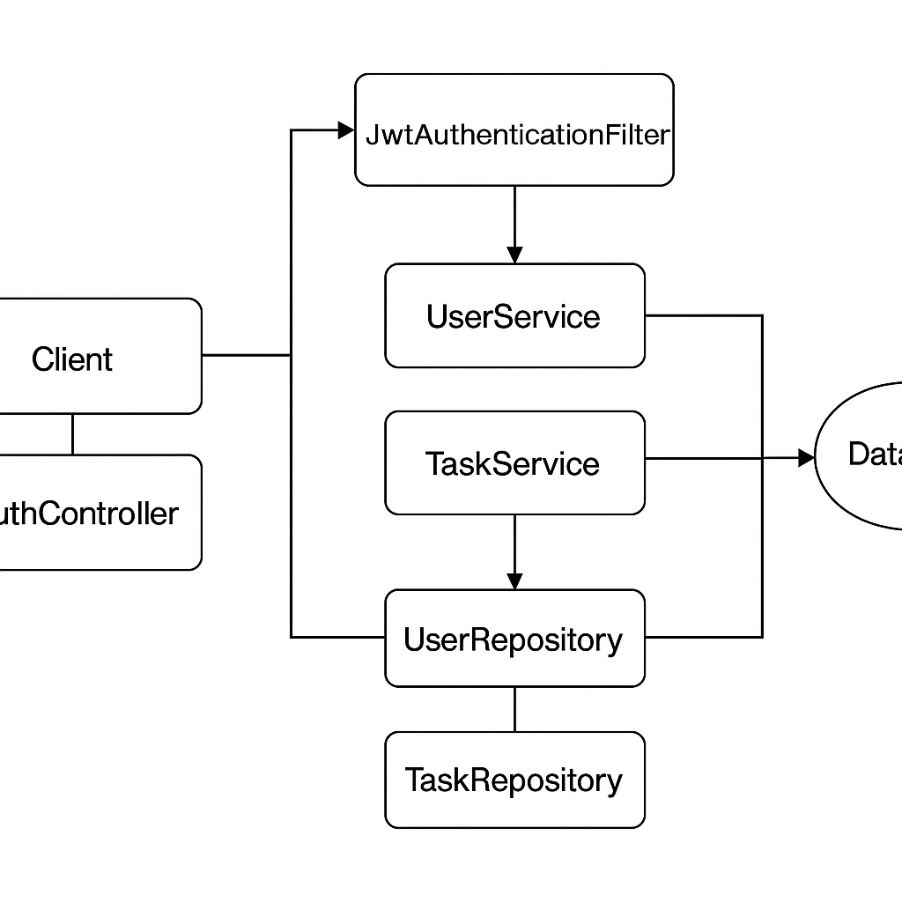

# SOA Auth App – Autenticação JWT com Spring Boot

## Funcionalidades

- **Registro e login de usuários:** via endpoints `POST /api/auth/register` e `POST /api/auth/login`. Senhas são criptografadas com BCrypt, conforme recomendado【828170898051826†L565-L569】. A aplicação é stateless; não são criadas sessões no servidor, graças à política `STATELESS` de Spring Security【828170898051826†L571-L577】.
- **CRUD de tarefas:** usuários autenticados podem criar, listar, atualizar e remover tarefas através de endpoints sob `/api/tasks`. A autenticação é feita via **JWT** enviado no cabeçalho `Authorization`.
- **Documentação automática:** o projeto utiliza SpringDoc e Swagger/OpenAPI para gerar documentação interativa dos endpoints. Ao iniciar a aplicação, acesse `/swagger-ui.html` para explorar a API.
- **Camadas claras:** as responsabilidades foram separadas em **controller**, **service** e **repository**, seguindo uma arquitetura orientada a serviços. Interfaces e injeção de dependências facilitam polimorfismo e despacho dinâmico de métodos.
- **Testes automatizados:** há testes unitários para `TaskServiceImpl` usando Mockito, e um teste de integração que cobre o fluxo de registro, login e operações de tarefas.

## Arquitetura

O diagrama abaixo ilustra os principais componentes da aplicação:

1. **Cliente** envia requisições HTTP para os **controladores** (`AuthController` e `TaskController`).
2. Os controladores delegam a lógica de negócios aos **serviços** (`UserService` e `TaskService`), que são definidos por interfaces e implementados em classes concretas. Essa abordagem promove polimorfismo e permite trocas de implementação sem modificar o restante do código.
3. Os serviços comunicam‐se com os **repositórios** (`UserRepository` e `TaskRepository`), responsáveis por persistir dados com Spring Data JPA.
4. Um **filtro JWT** intercepta cada requisição, valida o token e popula o contexto de segurança. A configuração de segurança define que apenas os endpoints de autenticação e documentação são públicos; todos os demais exigem autenticação.
5. **SpringDoc/OpenAPI** gera a documentação em tempo de execução.

## Tecnologias Utilizadas

- **Java 17** e **Spring Boot 3.1**
- **Spring Security** com JWT
- **Spring Data JPA** com **H2 Database** (banco em memória)
- **Bean Validation** (Jakarta Validation)
- **SpringDoc OpenAPI** para documentação
- **JUnit 5** e **Mockito** para testes

